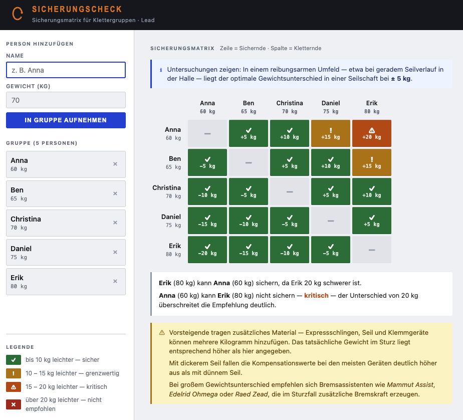

# Climb-Buddy-Belay

Einfaches Browser-Tool zur Sicherungsmatrix für Klettergruppen im Lead-Klettern.

## Was es macht

Personen mit Namen und Körpergewicht eintragen — das Tool berechnet automatisch, wer wen sichern kann. Die Ergebnisse werden als farbkodierte Matrix dargestellt:

| Farbe | Bedeutung |
|-------|-----------|
| Grün | bis 10 kg leichter — sicher |
| Gelb | 10–15 kg leichter — grenzwertig |
| Orange | 15–20 kg leichter — kritisch |
| Rot | über 20 kg leichter — nicht empfohlen |

Zeile = Sichernde Person, Spalte = Kletternde Person.

Ab einem Gewichtsunterschied von ≥ 15 kg erscheint ein Hinweis auf Bremsassistenten (Mammut Assist, Edelrid Ohmega, Raed Zead) sowie den Einfluss des Seildurchmessers auf die Kompensationswerte.

## Nutzung

Keine Installation, keine Abhängigkeiten. Datei direkt im Browser öffnen:

```
open index.html
```

Keine Persistenz — die Gruppe wird nicht gespeichert und geht beim Neuladen verloren.

## Hintergrund

In einem reibungsarmen Umfeld (gerader Seilverlauf in der Halle) liegt der optimale Gewichtsunterschied in einer Seilschaft bei ± 5 kg. Mit dickerem Seil fallen die Kompensationswerte bei den meisten Geräten deutlich höher aus als mit dünnem Seil.

# Beispiel


